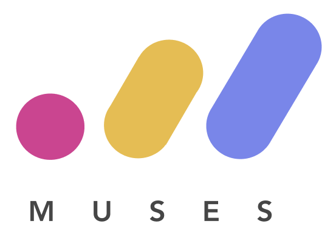

## What is this?

This is an introductory level workshop to ES6 features in JavaScript.

## Wait, ES...whaaaaa?
ES5 and ES6 refers to two different versions of JavaScript. Like apps and the modern web itself, programming languages like JavaScript can be updated to introduce new features that were previously unavailable to make it better to use. 

However, to make sure browsers and programmers understand how to read and use different versions, ECMAScript (prefixed in front of **ES**5 and **ES**6) provides a specification for JavaScript, so that it can standardised and consistent when it is used.

Many of the new features introduced when ES6 was released in 2015 are commonly used nowadays as it provides a more modern, readable and less verbose way of writing JavaScript, and is what you'd likely see at companies using JavaScript in their codebase today. Write less, do more.

In this tutorial, we'll build upon many of the concepts covered in the [Intro to JS](https://github.com/muses-code-js/intro-to-js-melbourne) tutorial to demonstrate the how and why between these two different ways of writing JavaScript. If you haven't done the previous tutorial and are unfamiliar with JavaScript basics, we strongly suggest you go and complete that one first.

## Why learn ES6?

Learning Javascript is a good idea for so many reasons.

Firstly, it's a core part of the modern web.  Almost all highly interactive web sites make heavy use of JavaScript to drive their UI in someway.  If you are interested in building frontend user experiences, JavaScript is a requirement.

Second, with the advent of Node.js it is possible to also use JavaScript to create both server-side and desktop applications.

And third, tools like Cordova and React Native make it possible to also build mobile applications with JavaScript.

It's increasingly the case that if you ask "Can I do that with Javascript?", the answer is yes.

Javascript isn't going anywhere, and the demand for developers with Javascript skills will only continue to grow. 

## Prerequisites

For beginners, it's great because it's easy to get started.  You don't need to learn any specialised, complicated tools.  All you need is the browser you already have.

We have a `Getting Started` section to get you started with web basics and some information about the tools (browser and an editor) that you will be using during the workshop. Make sure that you have a good grasp on the `Getting Started` section before going further. Otherwise, you will have some weird question marks in your mind during `Level 1` onwards.

If you feel that you are struggling, don't spend much time trying to figure it out on your own, just grab a mentor and ask for help. They will be more than happy to help you.

There will also be lightning talks during the day to elaborate on several topics to make you more familiar with the concepts. 

## Workshop Structure

This workshop is divided into a number of steps. At the end of each step, you will 
find a link to continue onto the next step.  

In most of the steps, we have some `Challenges` to get you to practise.

Then we have some links to resources to continue your studies.

